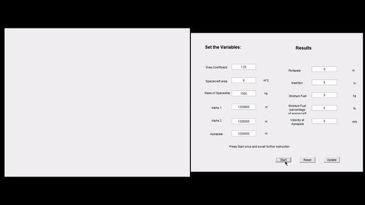

# Group 101
## Numerical Modelling of Aerocapture for a Scientific Mission to Venus
## MATLAB CODE

### How to operate
- Save all files including GUI fig
- Open intialvariables by typing it into the command window **please note it is mispelled intial NOT initial**
- Enter values for variables and press start
- Happy coding :))

